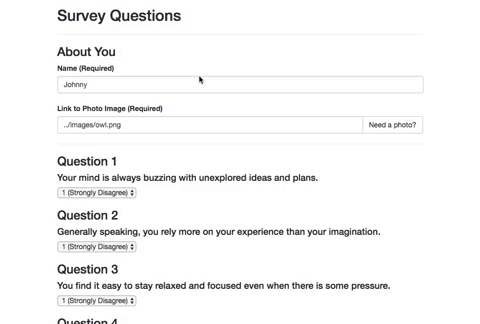

# FriendFinder

## Overview
This is a compatibility-finding application, similar to a dating app, developed for UNC's Coding Bootcamp. See the application in action on Heroku at: [https://friendfinder-stoversa.herokuapp.com/](https://friendfinder-stoversa.herokuapp.com/)

### Technologies Used
- [Node.js and npm](https://nodejs.org/en/download/ "Download Node.js and npm"). First, this application relies on both Node.js and npm to download Node packages and to run the application. Users can download the latest versions of both using the link to the left.
- [Express](https://expressjs.com/ "Express") - Standard practice Node middelware for routing.
- [Body-Parser](https://www.npmjs.com/package/body-parser-json "Body-Paser") - Node middleware for parsing html responses.


### Downloading This Application
To use this application:

1. Ensure that Node.js and npm are installed on your machine. For instructions, see the Technologies Used section below.
- Next, clone this repo to your local machine:
```
git clone git@github.com:stoversa/FriendFinder.git
```
2. Open the repo and execute the following in the bash terminal. Doing so should install the required NPM packages:
```
npm i
```

### Features Overview


This application allows users to fill out a brief 10-question survey. Once the user completes the survey, their results are matched with their most compatible friend (either from the example data, or from previously-used data from the user's same session).